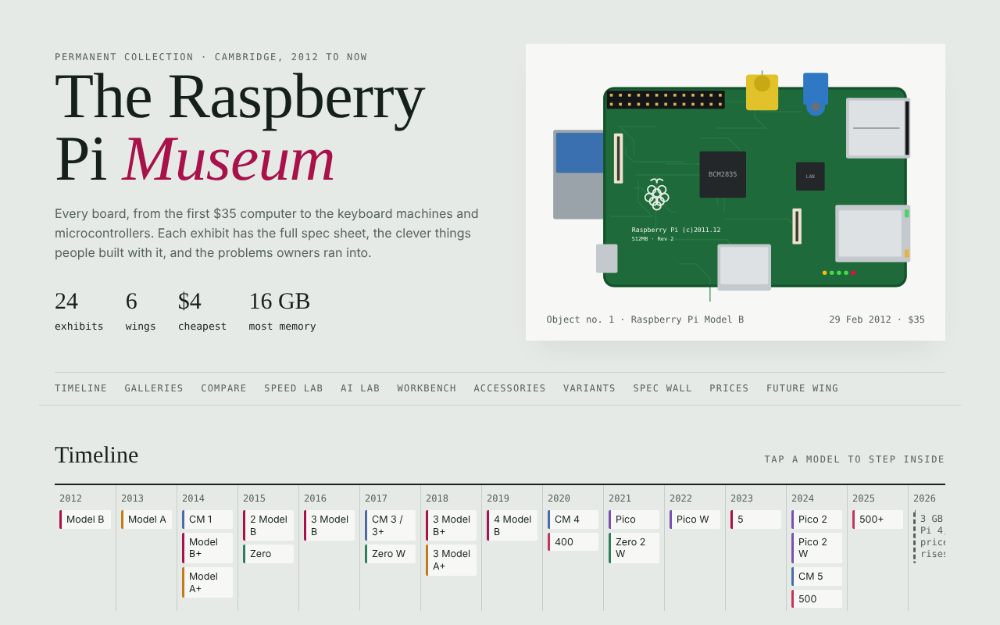
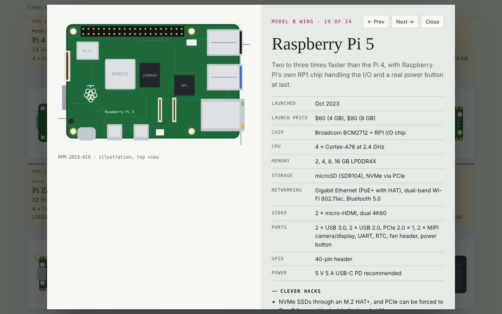
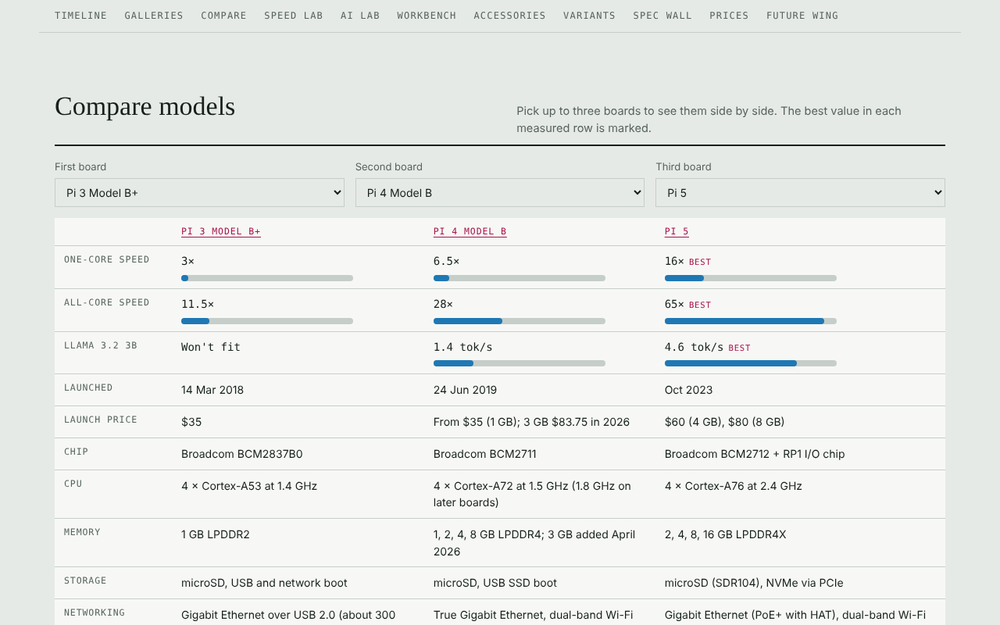
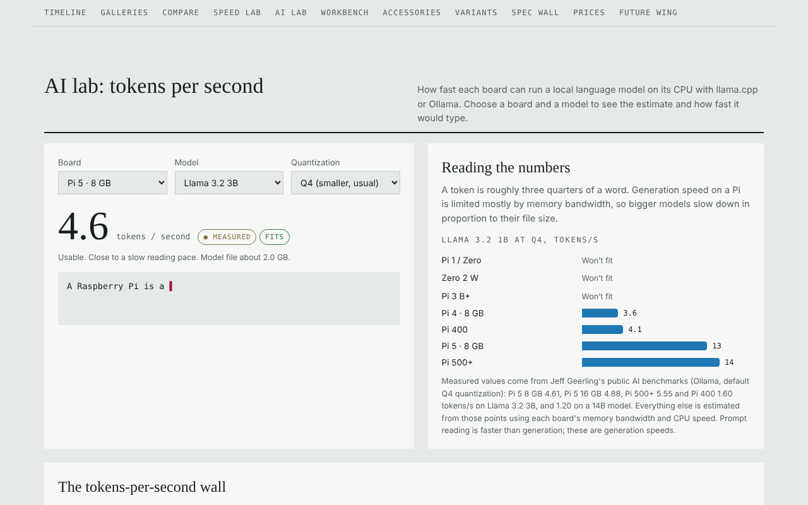
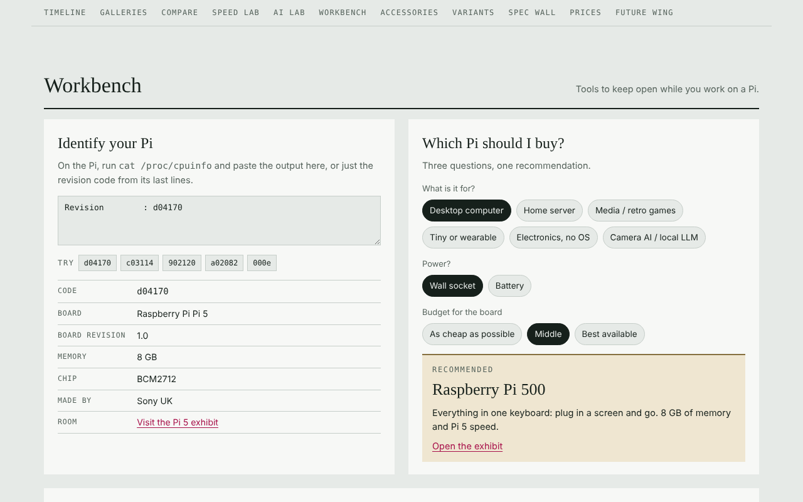

# The Raspberry Pi Museum

An online museum of every Raspberry Pi board, from the original Model B (February 2012)
to the Pi 500+ (2025), including the Zeros, Compute Modules, keyboard computers and the Pico
microcontrollers.

It's a single HTML file. Open `Raspberry Pi Museum.html` in any web browser: Windows, Mac,
Linux or a Raspberry Pi. No install and no internet needed (fonts load from Google Fonts
when online and fall back to system fonts offline).

## What's inside

- **24 exhibits** in six wings (Model B, Model A, Zero, Keyboard computers, Compute Modules,
  Pico), each with a drawing of the board, full specs, clever hacks, known issues and a museum note.
- **Workshop notes** in every room: power supply, typical draw, cooling, boot options,
  software support, a speed rating, an AI estimate and an overclock starting point to copy.
- **Compare** up to three boards side by side.
- **Speed lab**: one-core and all-core speed for every generation, with the 2012 Model B = 1.
- **AI lab**: tokens-per-second for local language models (SmolLM2 135M up to DeepSeek R1 14B)
  on every board, with a live typing demo and a full board-by-model table.
- **Workbench**: identify your Pi from `/proc/cpuinfo`, an interactive 40-pin GPIO map,
  a "Which Pi should I buy?" picker, and 14 copy-paste fix-it cards.
- **Accessories wing** (cameras, displays, HATs, cooler, power supply, SSD), **Variants and
  revisions**, a **Spec wall**, **Price then and now**, and a **Future wing**.

## Notes

- Measured tokens-per-second figures come from Jeff Geerling's public AI benchmarks
  (github.com/geerlingguy/ai-benchmarks); other figures are estimates scaled from those
  using each board's memory bandwidth and CPU speed.
- CPU speed ratios are estimates based on Raspberry Pi's official generation-to-generation
  speed-up figures.
- 2026 prices add the published April 2026 increases to the published December 2025 prices,
  so they are minimums.
- Illustrations are drawn in code, not photos, and not to scale.
